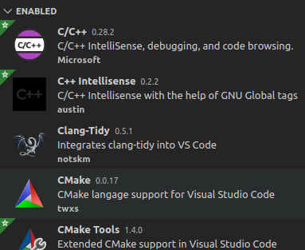

# UCPPND_Lesson02
Code examples from Udacity C++ Nanodegree Lesson02. Provide a structure to code, build and execute the examples using CMake.

I assume the Udacity C++ ND is taking C++17 under consideration. On my machine, a tiny little Lenovo X240, I'm running Xubuntu20.04, so g++ version 9.3.0 and cmake 3.16 is used. 

Using Visual Studio Code with plugins:

* Clang-Tidy provides an easy to use interface to the code checker using [c++ core code-guidlines](https://isocpp.github.io/CppCoreGuidelines/CppCoreGuidelines#Res-always)